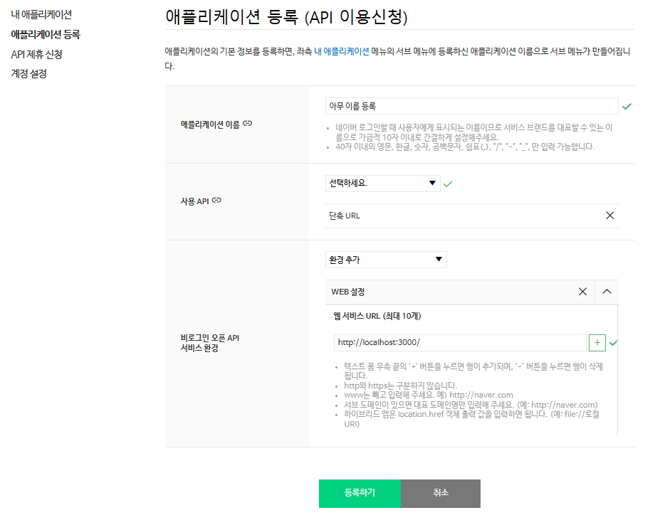

# 기능

URL을 작성한 뒤 버튼을 누르면 단축 URL과 QR 코드를 생성해줍니다.


- 단축 URL 클릭시 URL이 클립보드에 복사됩니다.
- QR 코드 클릭시 png 파일로 저장됩니다.

# 준비사항

- 네이버 계정
- 네이버 Open API
    - Client ID, Client Secret 발급
- React, Typescript, Electron 등 개발관련 기초 지식

# 사용방법

## 코드 clone

- 코드를 clone 합니다.

```bash
git clone https://github.com/appletail/shortURL.git
```

### 패키지 설치

- 패키지 매니저를 사용해 패키지를 설치합니다.

```bash
npm install  // NPM
yarn install  // Yarn
```

## 네이버 애플리케이션 등록

[NAVER Developers](https://developers.naver.com/)에 접속하여 애플리케이션을 등록합니다.  

예시)


## 시크릿 키 등록하기

src/clientConfig.ts 파일을 열고 Client ID와 Client Secret 입력합니다.

```ts
# clientConfig 파일 예시
export const client_id = 'aElPa85OjQDEW34ios8426d848Z'  // Client ID 입력
export const client_secret = 'pQ1NEv5QAE'  // Client Secret 입력
```

## 빌드하기

- 터미널에서 아래 명령어를 실행합니다.

```bash
npm run build
npm run dist
```

### 데스크탑 애플리케이션으로 만들기전 테스트를 원하는 경우
```bash
npm run build
npm run electron
```

## 실행하기
release/win-unpacked 폴더에 데스크탑 애플리케이션이 생성됩니다.  
release/win-unpacked/shorturl.exe 파일을 실행하시면 됩니다.

